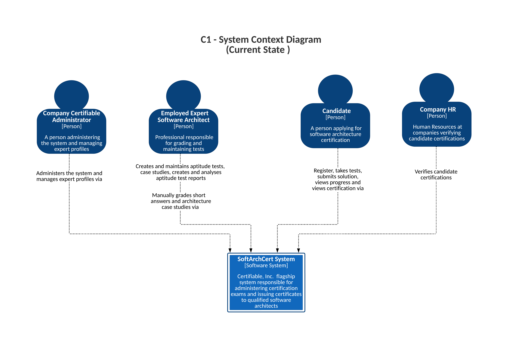

# Current State of SoftArchCert System (C1 - System Context Diagram) 

## **Description**
Below is an overview of the current state of the SoftArchCert System, which administers certification exams for software architects. The diagram captures the current manual and system-driven interactions for managing certifications. It showcases how different users interact with the system.

## **Key Stakeholders and Interactions**

1. **Company Certifiable Administrator:**
   - Administers the system and manages expert profiles via the SoftArchCert System.

2. **Employed Expert Software Architect:**
   - Creates and maintains aptitude tests and case studies.
   - Manually grades short answers and architecture case studies via the system.

3. **Candidate:**
   - Registers, takes tests, submits solutions, views progress, and certification through the system.

4. **Company HR:**
   - Verifies candidate certifications via the SoftArchCert System.

5. **SoftArchCert System:**
   - The flagship system responsible for administering exams and issuing certificates to qualified software architects.

