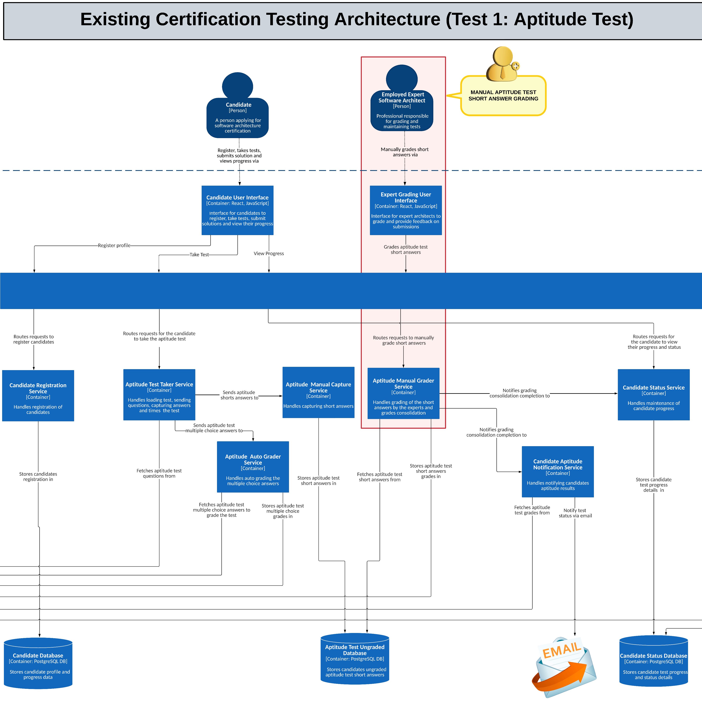

# **Current State of SoftArchCert System (C2 - Container Diagram)**

## **Description**
The **SoftArch Cert System** ensures efficient management of certification processes through modular services, reliable databases, and user interfaces designed for various stakeholders. The architecture currently relies on **manual processes for creating questions, grading short answers and architecture solutions**, with data being stored in multiple PostgreSQL databases. REST APIs and React-based UIs facilitate interactions across the system.

## **A - Existing Administrative Architecture**

### **Key Stakeholders:**
- **Company Certifiable Administrator**: Administers system, manages expert profiles.
- **Employed Expert Software Architect**: Creates/maintains tests, case studies, and analyses.

### **Key Components and Services:**
- **Company Admin UI (React, JS)**: Manages expert profiles and facilitates system administration.
- **Expert Architect UI (React, JS)**: Provides grading tools and feedback generation for experts.
- **Admin API Gateway (REST API)**: Routes admin/expert requests with efficient error handling and load balancing.
- **User Maintenance Service**: Maintains expert profiles and supports user authentication.
- **Aptitude Test Maintenance Service**: Maintains and updates aptitude test data regularly.
- **Case Study Maintenance Service**: Maintains case studies and ensures data integrity.
- **Aptitude Test Analysis Service**: Analyses test data and generates performance reports.

### **Databases:**
- **Expert Profile DB (PostgreSQL)**: Stores expert profiles with role-based access.
- **Aptitude Test DB (PostgreSQL)**: Stores test questions/answers with version control.
- **Architecture Case Study DB (PostgreSQL)**: Stores case studies with backup mechanisms.
- **Aptitude Test Grade DB (PostgreSQL)**: Stores test grades with audit logs.

## **B - Existing Certification Testing Architecture (Test 1: Aptitude Test)**

### **Key Stakeholders:**
- **Candidate**: Registers, takes tests, views progress.
- **Employed Expert Software Architect**: Manually grades short answers.

### **Key Components and Services:**
- **Candidate UI (React, JS)**: Provides registration, test access, and result tracking.
- **Candidate Registration Service**: Registers candidates and verifies eligibility.
- **Aptitude Test Taker Service**: Manages tests, time limits, and question sets.
- **Aptitude Manual Capture Service**: Captures short answers and ensures data security.
- **Aptitude Manual Grader Service**: Manually grades short answers with grading templates.
- **Aptitude Auto Grader**: Auto-grades MCQs with minimal latency.
- **Candidate Status Service**: Tracks progress, updates records, and sends reminders.
- **Candidate Notification Service**: Sends notifications via email and SMS.

### **Databases:**
- **Candidate DB (PostgreSQL)**: Stores profiles with encryption.
- **Aptitude Test Ungraded DB (PostgreSQL)**: Stores ungraded tests with timestamps.
- **Candidate Status DB (PostgreSQL)**: Tracks progress/status with history logs.

## **C - Existing Certification Testing Architecture (Test 2: Architecture Solution)**

### **Key Stakeholders:**
- **Candidate**: Submits solutions.
- **Employed Expert Software Architect**: Grades solutions.
- **Company HR**: Verifies certification.

### **Key Components and Services:**
- **Candidate UI (React, JS)**: Submits/view solutions with intuitive navigation.
- **Public API Gateway (REST API)**: Routes requests securely and efficiently.
- **Case Study Retrieval Service**: Retrieves case studies with caching.
- **Architecture Submission Service**: Handles submissions and validates formats.
- **Architecture Manual Grader Service**: Manually grades solutions with detailed rubrics.
- **Candidate Certification Service**: Generates certificates with digital signatures.
- **Candidate Viewer Service**: Views certificates with filtering options.

### **Databases:**
- **Submissions Ungraded DB (PostgreSQL)**: Stores ungraded solutions with metadata.
- **Architecture Grade DB (PostgreSQL)**: Stores grades/feedback with version history.
- **Certification DB (PostgreSQL)**: Stores certification records with access logs.

