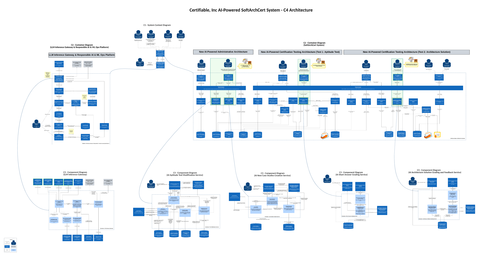

# AI-Powered SoftArchCert System - Target State (C4 Architecture)

## Description
The below outlines the target state architecture for the Certifiable, Inc AI-Powered SoftArchCert System using the C4 model. The architecture is designed to provide a scalable, AI-powered platform for software architecture certification, covering administrative processes, aptitude tests, and architecture solution assessments.

It ensures a robust and responsible AI-powered certification process, integrating manual oversight with automated efficiency.

[Click here to see the PDF version to zoom in and explore the full architecture details](../../images/architecture/architecture-target-state.pdf)

## SoftArchCert System - C4 Architecture

### C1 - System Context Diagram
The C1 System Context Diagram highlights the overall landscape and shows key stakeholders (Company Admin, Expert Architects, Candidates, Company HR, and ML Engineers) interacting with the SoftArchCert System, which administers certification processes, integrates AI for grading and test creation, and is supported by the LLM Inference Gateway for responsible AI operations.

### C2 - Container Diagrams
The C2 Container Diagrams depict the major building blocks to enable the AI-powered capabilities in the SoftArchCert System. Each container, is responsible for distinct operations. It illustrates the SoftArchCert System's AI-powered architecture, automating test creation, grading, and certification while providing expert interfaces for validation. It also highlights the Responsible AI & ML Ops Platform, ensuring ethical AI operations, data sanitisation, monitoring, and continuous model improvement for scalable, accurate, and efficient certification management.
- **SoftArchCert System**: Encompasses administrative architecture, aptitude test management, and architecture solution assessment services.
- **LLM Inference Gateway & Responsible AI & ML Ops Platform**: Ensures responsible AI operations, data sanitisation, and routing of LLM calls.

### C3 - Component Diagrams
The Component Diagrams provide detailed views of individual services:
- **LLM Inference Gateway**: Routes, validates, filters, and caches LLM calls to ensure safe, reliable, and cost-effective AI interactions.
- **AI Aptitude Test Modification Service**: Generates, modifies, and validates aptitude test questions leveraging LLM capabilities with expert oversight and review workflows for experts to approve AI-generated questions.
- **AI New Case Studies Creation Service**: Generates new case studies with expert feedback loops. Generates and refines case studies leveraging AI, with expert oversight and review workflows to validate and approve AI-generated case studies.
- **AI Short Answer Grading Service**: Automates short-answer grading using AI, ensuring consistent evaluations with expert oversight and review workflows for experts to approve AI-generated grades.
- **AI Architecture Solution Grading and Feedback Service**: Automates grading of architecture solutions using AI with predefined rubrics, supported by expert oversight and review workflows for experts to approve AI-generated grades and feedback.
