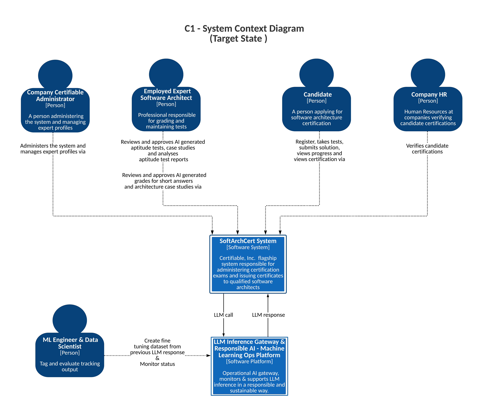

# Target State of SoftArchCert System (C1 - System Context Diagram) 

## **Description**
The target state of the SoftArchCert System showcases its future vision, integrating AI to enhance certification processes. The diagram illustrates user interactions with the system to leverage AI-powered capabilities for improved efficiency, reduced manual tasks, and scalable certification processes while using responsible AI through the LLM Inference Gateway, which supports and monitors AI inference responsibly.

## **Key Stakeholders and Interactions**

1. **Company Certifiable Administrator:**
   - Continues to administer the system and manage expert profiles via the SoftArchCert System.

2. **Employed Expert Software Architect:**
   - Reviews and approves AI-generated aptitude tests and case studies.
   - Reviews and approves AI-generated grades for short answers and architecture case studies.

3. **Candidate:**
   - Registers, takes tests, submits solutions, views progress, and certification through the system.

4. **Company HR:**
   - Verifies candidate certifications via the SoftArchCert System.
  
5. **SoftArchCert System:**
   - Administers exams, issues certificates, and integrates AI for grading and test creation.

6. **ML Engineer & Data Scientist:**
   - Creates fine-tuning datasets from previous LLM responses.
   - Tags and evaluates AI output, monitors status.

7. **LLM Inference Gateway & Responsible AI - Machine Learning Ops Platform:**
   - Operational AI gateway, supports and monitors LLM inference responsibly.

