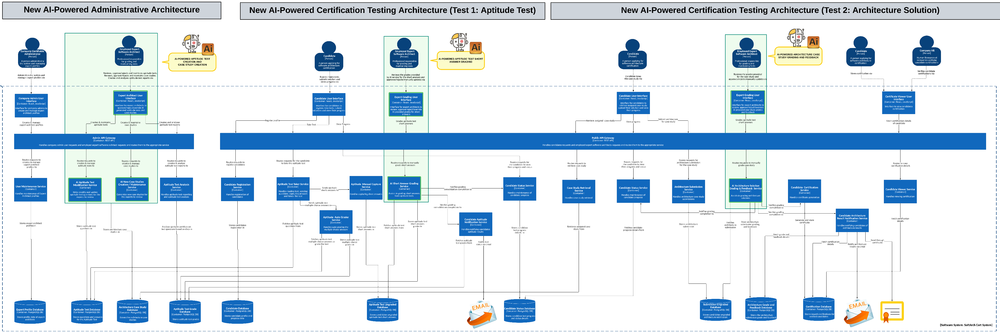
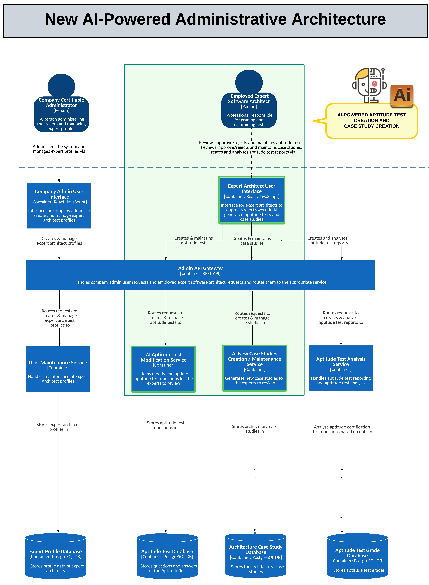
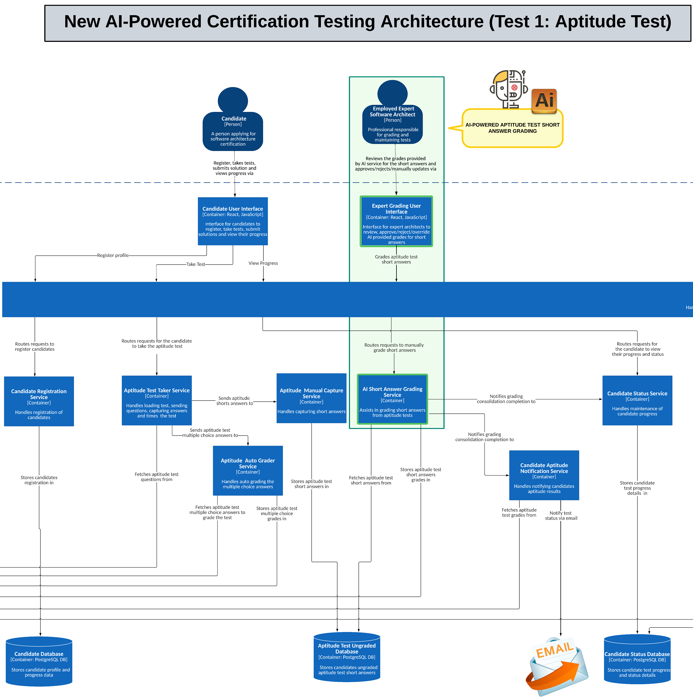
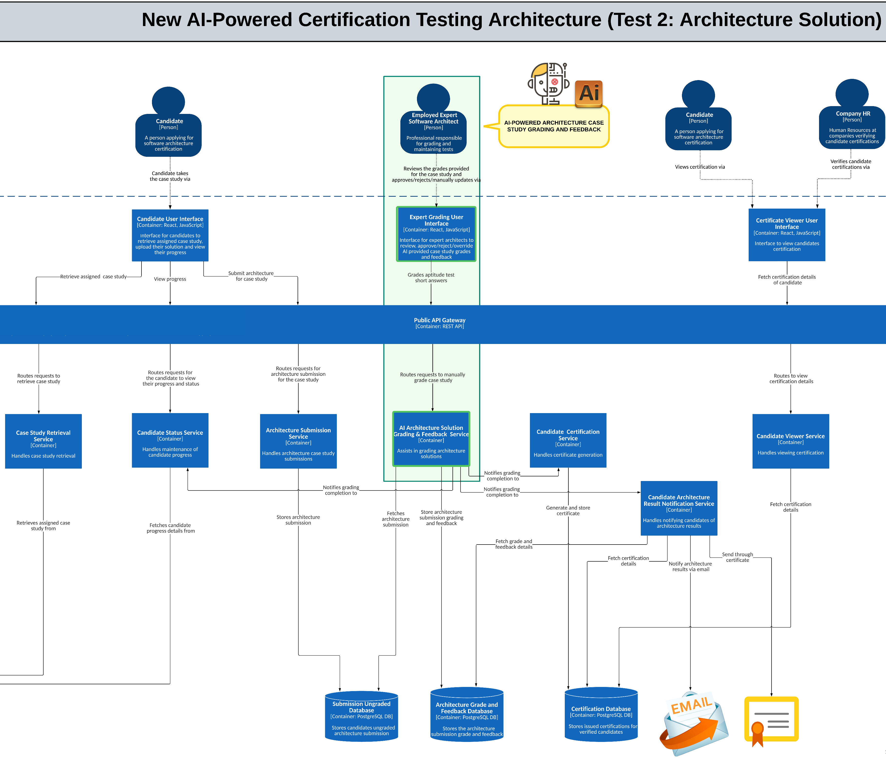

# **Target State of SoftArchCert System (C2 - Container Diagram)**

## **Description**
The **SoftArch Cert System** future state integrates AI-powered capabilities to automate test creation, grading, and feedback processes while providing expert interfaces for review, acceptance, rejection, or override of AI-generated content. This reduces manual efforts, enhances scalability, and ensures accurate and consistent certification management through a combination of AI automation and expert validation.

## **A - AI-Powered Administrative Architecture**

### **Key Stakeholders:**
- **Company Certifiable Administrator**: Administers system, manages expert profiles.
- **Employed Expert Software Architect**: Reviews, approves/rejects, and maintains tests, case studies, and reports.

### **Key Components and Services:**
- **Company Admin UI (React, JS)**: Manages expert profiles and system administration.
- **Expert Architect UI (React, JS)**: Provides tools for reviewing and overriding AI-generated content.
- **AI Aptitude Test Modification Service**: AI modifies and updates aptitude questions.
- **AI New Case Studies Creation Service**: AI generates new case studies for expert validation.
- **Admin API Gateway (REST API)**: Routes requests with AI-assisted optimisations.

### **Databases:**
- **Expert Profile DB**: Stores expert profiles.
- **Aptitude Test DB**: Stores AI-generated and validated questions.
- **Case Study DB**: Stores AI-generated case studies.
- **Aptitude Test Grade DB**: Stores AI-graded results.

## **B - AI-Powered Certification Testing Architecture (Test 1: Aptitude Test)**

### **Key Stakeholders:**
- **Candidate**: Registers, takes tests, views progress.
- **Employed Expert Software Architect**: Reviews AI-graded tests.

### **Key Components and Services:**
- **Candidate UI**: Provides test access and progress tracking.
- **AI Short Answer Grading Service**: AI grades short answers with expert review options.
- **Candidate Notification Service**: Sends AI-triggered notifications.
- **Candidate Status Service**: Maintains progress.

### **Databases:**
- **Candidate DB**: Stores candidate data.
- **Aptitude Test Ungraded DB**: Stores AI-evaluated tests awaiting expert review.
- **Candidate Status DB**: Tracks progress.

## **C - AI-Powered Certification Testing Architecture (Test 2: Architecture Solution)**

### **Key Stakeholders:**
- **Candidate**: Submits solutions.
- **Employed Expert Software Architect**: Reviews AI-graded architecture solutions.
- **Company HR**: Verifies certification.

### **Key Components and Services:**
- **AI Architecture Solution Grading Service**: AI grades solutions with expert oversight.
- **Case Study Retrieval Service**: Retrieves case studies.
- **Candidate Certification Service**: Issues certificates.

### **Databases:**
- **Submissions DB**: Stores AI-evaluated submissions.
- **Architecture Grade DB**: Stores AI-graded solutions and feedback.
- **Certification DB**: Stores certification records.

