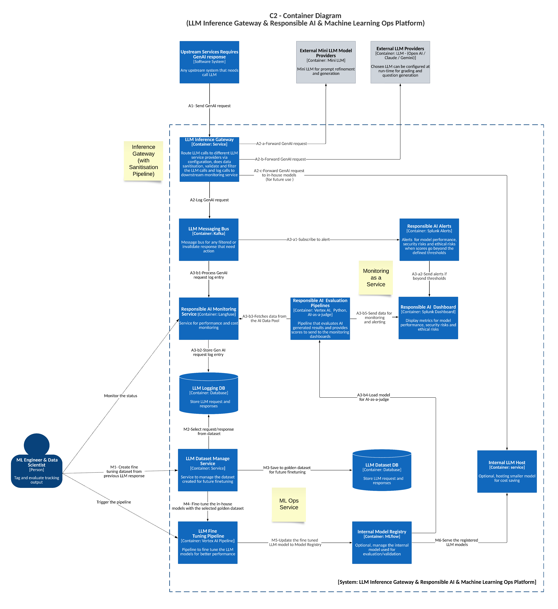

# **LLM Gateway and Observability & Monitoring Component - Responsible AI Platform (C2 - Container Diagram)**  

## **Description**  

The **LLM Gateway and Observability & Monitoring Component** is responsible for **tracking AI model performance, monitoring costs, evaluating Responsible AI risks, and alerting stakeholders to potential security or ethical concerns**. It supports both **logging & monitoring (A-flow)** and **dataset collection & fine-tuning (M-flow)** to ensure transparency, fairness, and continuous improvement in AI-driven workflows.  

  

## **Core Functionality**  

- **Performance Monitoring**: Tracks AI model performance and overall system efficiency.  
- **Cost Monitoring**: Observes the operational costs associated with AI processing.  
- **Responsible AI Evaluation**: Assesses AI-generated results for biases, security risks, and ethical violations.  
- **Alerting & Risk Detection**: Sends alerts when performance, security, or ethical risks exceed predefined thresholds.  
- **Data Sanitization**: Ensures sensitive data is removed from all AI-generated responses.  
- **LLM Fine-Tuning**: Supports continuous model refinement for better performance.  

## **Key Components**  

### **1. Responsible AI Monitoring Service**  
- Tracks **AI system performance and cost metrics**.  
- Fetches **GenAI request logs** for analysis.  

### **2. Responsible AI Evaluation Pipelines**  
- Periodically pulls LLM request history for **automated Responsible AI evaluation**.  
- Assesses responses for **bias, security risks, and ethical concerns**.  

### **3. Responsible AI Alerts**  
- **Monitors AI responses** for potential violations.  
- **Generates alerts** when detected risks exceed predefined thresholds.  

### **4. Responsible AI Dashboard**  
- **Visualizes AI system performance, security, and ethical risks**.  
- Displays **alerts and evaluation scores** for expert review.  

### **5. LLM Logging Database**  
- **Stores GenAI requests and responses** for monitoring and auditing.  
- Used in **A-flow** to maintain system logs and track AI behavior.  

### **6. LLM Dataset Database**  
- **Stores high-quality (golden) LLM requests and responses** for future training.  
- Integral to **M-flow** for dataset creation and improvement.  

### **7. LLM Dataset Management Service**  
- **Manages dataset curation** for future model fine-tuning.  
- Supports **selection and validation** of golden data.  

### **8. LLM Fine-Tuning Pipeline**  
- **Uses the golden dataset to refine LLM models**.  
- Ensures **continuous learning and accuracy improvement**.  

### **9. Internal Model Registry**  
- **Manages trained AI models** with version control.  
- Ensures **reproducibility and controlled deployment** of LLM updates.  

### **10. Internal LLM Host**  
- **Hosts the latest registered LLM models** for evaluation and use.  
- Supports **real-time model access for inference and analysis**.  

---

## **Data Flow**  

The system operates across **two major workflows (A-flow & M-flow)**:  

### **A-Flow: Logging & Monitoring**  

1. **A1:** An upstream service sends a **GenAI request**.
   * **a:** The request is forwarded to an external mini LLM.
   * **b:** The request is forwarded to an external LLM provider.
   * **c:** The request is forwarded to an in-house model.  
3. **A2:** The request is **logged in the LLM Response Topic**.
   * **a1:** The topic is subscribed to by the Responsible AI Alerts service.
   * **b1:** The request is processed by the Responsible AI Monitoring service.  
4. **A3:** The **Responsible AI Monitoring Service** retrieves the log entry.
   * **a2:** If a response exceeds a **risk threshold**, an alert is triggered by the **Responsible AI Alerts Service**.
   * **b2:** The **GenAI request and response are stored in the LLM Logging Database**.
   * **b3:** Data is fetched from the data pool using the **Responsible AI Evaluation Pipelines**.
   * **b4:** A model is selected to be used as an LLM as a Judge.
   * **b5:** Alerts and risk scores are **sent to the Responsible AI Dashboard** for action.  

### **M-Flow: Dataset Collection & Fine-Tuning**  

1. **M1:** Experts manually select **golden requests and responses** for dataset creation.  
2. **M2:** The **golden dataset is stored in the LLM Dataset Database**.  
3. **M3:** The **fine-tuning pipeline selects data** from the dataset for model retraining.  
4. **M4:** The **LLM model is fine-tuned** using selected golden data.  
5. **M5:** The **updated model is registered in the Internal Model Registry**.  
6. **M6:** The **registered LLM models are deployed to the Internal LLM Host**.  

---

## **Benefits**  

- **Ensures Responsible AI practices** through performance, security, and ethical monitoring.  
- **Enhances model accuracy and fairness** via continuous evaluation and fine-tuning.  
- **Provides transparency** in AI decision-making and logging.  
- **Supports compliance** with data privacy and security regulations.  

---

## **Tech Stack**  

- **Langfuse**  
- **Vertex AI**  
- **Python**  
- **Splunk**  
- **Kafka**  
- **MLflow**  
- **PostgreSQL**  
