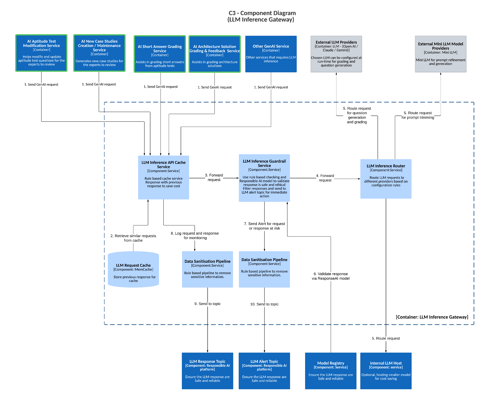

# **LLM Inference Gateway (C3 - Component Diagram)**  

## **Description**  

The **LLM Inference Gateway** is a middleware service responsible for **routing, validating, filtering, and caching** Large Language Model (LLM) calls. It ensures **safe, reliable, and cost-effective** interactions with LLM service providers.  

  

## **Core Functionality**  

- **LLM Call Routing**: Dynamically routes LLM requests to different providers based on configurable rules.  
- **Validation & Filtering**: Ensures LLM responses comply with safety and ethical guidelines.  
- **Data Sanitization**: Removes sensitive information from requests and responses using rule-based pipelines.  
- **Caching**: Caches responses to reduce latency and operational costs.  
- **Guardrails**: Enforces Responsible AI principles through rule-based checks and in-house AI models.  

## **Key Components**  

- **LLM Inference API Cache Service**: Implements rule-based caching to optimize cost and performance.  
- **LLM Inference Guardrail Service**: Validates responses for safety and ethical compliance.  
- **LLM Inference Router**: Directs requests to the appropriate LLM provider based on predefined rules.  
- **Data Sanitization Pipeline**: Analyzes and removes sensitive data from input and output.  
- **LLM Request Cache**: Stores recent requests to improve efficiency and prevent redundant processing.  

## **Data Flow**  

1. A **GenAI request** is sent to the **LLM Inference Gateway**.  
2. The gateway **checks the cache** for recent similar requests. If found, it **returns the cached response**.  
3. If no cache hit, the request is forwarded to the **LLM Inference Router**.  
4. The router selects and sends the request to the **most suitable LLM provider**.  
5. The **LLM provider generates a response** and sends it back to the gateway.  
6. The response undergoes **validation and filtering** using **rules and Responsible AI models**.  
7. If flagged as unsafe, an **alert is triggered** via the **LLM Alert Topic** for further action.  
8. The **request and response are logged** for monitoring and auditing purposes.  

## **Benefits**  

- **Ensures safety and reliability** by enforcing strict validation and filtering mechanisms.  
- **Reduces costs** through **caching** and **intelligent routing** to optimize provider selection.  
- **Enhances performance** by minimizing redundant LLM calls and improving response times.  
- **Protects sensitive data** via automatic sanitization of requests and responses.  

## **Tech Stack**  

- **Microservices Architecture**  
- **Memcached** for caching  
