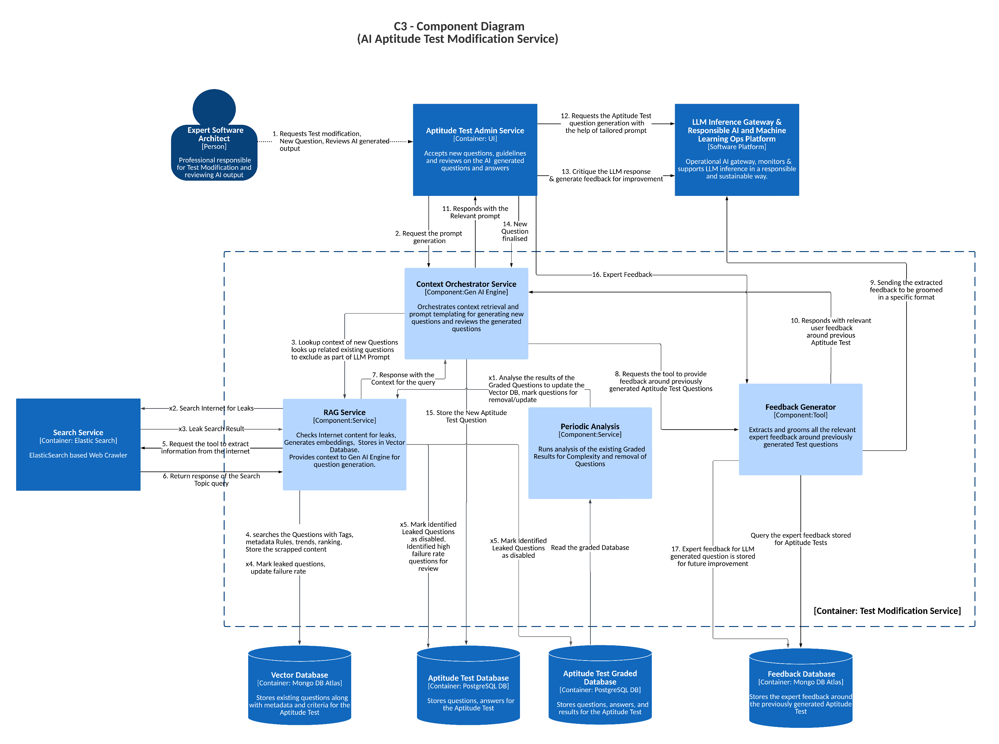

# **AI Aptitude Test Modification Service (C3 - Component Diagram)**  

## **Description**  

The **AI Aptitude Test Modification Service** is designed to **generate, modify, validate, and improve aptitude test questions** through AI-assisted workflows. It operates across two primary workflows:  

1. **Question Creation & Modification Flow** – Focused on generating and refining test questions.  
2. **Automated Analysis Flow** – Ensures quality control, detects issues, and tracks question performance.  

  

## **Core Functionality**  

- **Aptitude Test Administration**: Provides an interface for expert software architects to create, modify, and review test questions.  
- **Context-Orchestrated Question Generation**: Uses AI to generate questions aligned with difficulty, validity, and learning objectives.  
- **Retrieval-Augmented Generation (RAG)**: Retrieves relevant information to refine and validate AI-generated questions.  
- **Search & Trend Analysis**: Continuously updates test questions based on industry trends.  
- **Feedback-Driven Refinement**: Enhances question quality through expert feedback and AI-driven critiques.  
- **LLM-Powered Question Processing**: Generates, refines, and validates test questions while ensuring adherence to predefined rubrics.  
- **Automated Quality Assurance**: Detects leaks, tracks performance, and flags problematic questions for expert review.  

## **Key Components**  

### **1. Aptitude Test Admin Service**  
- Acts as the **primary interface** for **expert software architects**.  
- Manages **question creation, modification, and review** workflows.  
- Integrates with the **Context Orchestrator Service** for AI-assisted question generation.  
- Handles **final approval and storage** of validated test questions.  

### **2. Context Orchestrator Service**  
- **Retrieves contextual data** to enhance AI-generated test questions.  
- Extracts **relevant content** from test banks, external sources, and expert feedback.  
- Ensures generated questions **align with predefined learning objectives**.  
- Coordinates with **RAG Service** and **Feedback Generator** to refine question prompts.  

### **3. RAG (Retrieval-Augmented Generation) Service**  
- **Retrieves contextual data** from the **Vector Database**.  
- **Detects duplicates** and prevents question leaks.  
- Pulls **relevant industry trends** from the **Search Service** to update test questions.  
- Tracks **difficulty levels** and **categorization** of generated questions.  

### **4. Search Service**  
- Uses **ElasticSearch-based web crawlers** to monitor online sources for **topic trends**.  
- **Ensures test questions remain current** and **validates uniqueness** to prevent leaks.  

### **5. Feedback Generator Service**  
- Stores and retrieves **expert feedback** on AI-generated questions.  
- Uses **LLM-driven critique** to refine question quality.  
- Captures and archives **historical feedback** for trend tracking and continuous improvement.  

### **6. LLM Inference Gateway**  
- Processes **context-enhanced** test question prompts.  
- Generates **AI-driven test question candidates** with explainable reasoning.  
- **Refines AI-generated questions** using contextual data and expert feedback.  
- Ensures adherence to **predefined rubrics and quality standards**.  

---

## **Data Stores**  

### **1. Vector Database**  
- Stores **question trends, industry updates, and reference materials**.  
- Maintains **question metadata** and **contextual relationships**.  
- Tracks **question status** (e.g., leaked, duplicate, high failure rate).  

### **2. Feedback Database**  
- Archives **expert feedback** on generated questions.  
- Stores **question performance metrics** (accuracy, difficulty, student success rate).  
- Maintains **historical improvement data** for tracking **question evolution**.  

### **3. Aptitude Test Database**  
- Serves as the **primary storage** for validated test questions.  
- Maintains **metadata, categorization, and version history**.  
- Tracks **modifications and expert reviews**.  

---

## **Automated Analysis Workflow**  

The **Automated Analysis Flow** ensures continuous quality control by:  

1. **Monitoring** test question performance across multiple exams.  
2. **Detecting leaks** to prevent compromised test integrity.  
3. **Identifying high failure rate questions (90-95%)** for expert review.  
4. **Automatically flagging** problematic or outdated questions.  
5. **Updating question status** across all relevant databases.  

---

## **Security and Quality Controls**  

### **1. Question Validation**  
- **Multi-stage AI + expert review** for all AI-generated questions.  
- **Leak detection** to prevent exposure of test content.  
- **Performance monitoring** to ensure **difficulty accuracy**.  
- **Expert approval required** for final question validation.  

### **2. Quality Assurance**  
- **Calibrates difficulty levels** to match learning objectives.  
- **Tracks failure rates** to detect problematic test questions.  
- **Ensures contextual accuracy** of generated questions.  
- **Identifies duplicates** to prevent redundancy.  

### **3. Feedback Loop**  
- **Continuous improvement** via **expert feedback** and **AI-driven critiques**.  
- **Historical performance tracking** to measure **question effectiveness**.  
- **Industry trend analysis** to **align test content with real-world needs**.  
- **Automated quality metrics** to maintain **long-term validity**.  

---

## **Integration Points**  

### **1. External Systems**  
- **Web crawlers** for **trend analysis and validation**.  
- **Industry monitoring** to detect **emerging topics**.  
- **LLM integration** for **automated test question generation and refinement**.  
- **Expert interfaces** for **manual review and approval**.  

### **2. Internal Systems**  
- **Database synchronization** for real-time updates.  
- **AI-driven grading and review services**.  
- **Automated feedback processing** for improving AI-generated content.  
- **Test question tracking** for version control and quality monitoring.  

---

## **System Boundaries**  

The system maintains **strict modular separation** between:  
- **User interaction layers** (experts requesting and modifying questions).  
- **Processing services** (AI-driven generation, critique, and review).  
- **Storage systems** (Vector DB, Aptitude Test DB, Feedback DB).  
- **Automated analysis components** (RAG, Search Service, Context Orchestrator).  
- **Feedback mechanisms** (expert input and AI-driven iterative refinement).  

This architecture ensures **scalability, maintainability, and high-quality AI-assisted test question management**, while enabling **continuous improvement through expert oversight and automated analytics**.  

## **Tech Stack**

- **Messaging Topic (GCP Pub/Sub or Kafka)**
- **PostgreSQL DB**
- **Mongo DB**
- **ElasticSearch**
- **Python**