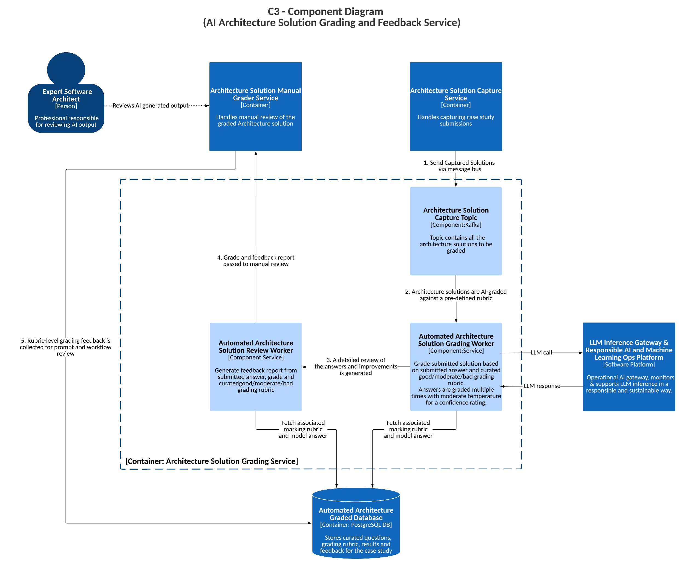

# **Architecture Solution Grading and Feedback Service (C3 - Component Diagram)**

## **Description**

The **Architecture Solution Grading and Feedback Service** automates the evaluation of case study submissions, ensuring consistency, fairness, and efficiency in grading. It utilizes AI to score solutions against predefined rubrics while allowing for expert review and feedback. These predefined rubrics will be curated by human experts as part of the AI transformation process and take the form of a grading template with model answers and reasoning to assist AI in their reasoning over grades.

## **Core Functionality**

- **Automated Architecture Solution Grading**: AI workflow grades submitted solutions based on curated answers and marking rubrics.
- **Confidence Metrics**: AI generates multiple grades per submission using moderate temperature sampling to produce confidence scores.
- **Expert Manual Review**: Experts can review AI-graded solutions and adjust scores.
- **Feedback Generation**: AI generates detailed feedback reports on answers and improvements.
- **Grading Rubric and Model Answer Storage**: Stores curated questions, grading rubrics, and model answers for reference.
- **Responsible AI Oversight**: Ensures AI-generated responses align with Responsible AI policies.

## **Key Components**

- **Architecture Solution Capture Service**: Captures case study submissions and sends them via a message bus.
- **Architecture Solution Capture Topic**: A Kafka topic that contains architecture solutions to be graded.
- **Automated Architecture Solution Grading Worker**: AI worker that grades submitted solutions based on predefined rubrics and multiple grading passes.
- **Automated Architecture Solution Review Worker**: Generates feedback reports based on submitted answers and grading rubrics.
- **Architecture Solution Manual Grader Service**: Allows experts to review and refine AI-generated grades.
- **Automated Architecture Solution Graded Database**: Stores curated questions, grading rubrics, results, and feedback for case studies.
- **LLM Inference Gateway**: Routes LLM calls to different providers, validates responses, and dispatches them for monitoring.
- **Responsible AI Platform**: Ensures AI-generated evaluations are safe, reliable, and unbiased.

## **Data Flow**

1. **Architecture Solution Capture Service** receives case study submissions and sends them via a message bus.
2. **Architecture Solution Capture Topic** distributes submissions to grading workers.
3. **Automated Architecture Solution Grading Worker** grades solutions against predefined rubrics using multiple passes for confidence estimation.
4. **Automated Architecture Solution Review Worker** generates detailed feedback reports based on grading results.
5. **Architecture Solution Manual Grader Service** allows experts to manually review AI-generated grades and refine them.
6. **Rubic-level grading feedback** is collected for prompt and workflow improvements.

## **Benefits**

- Reduces grading time while maintaining quality.
- Ensures consistent grading with explainable AI feedback.
- Allows human experts to refine AI-generated evaluations.

## **Tech Stack**

- **Messaging Topic (GCP Pub/Sub or Kafka)**
- **PostgreSQL DB**
- **Python**
