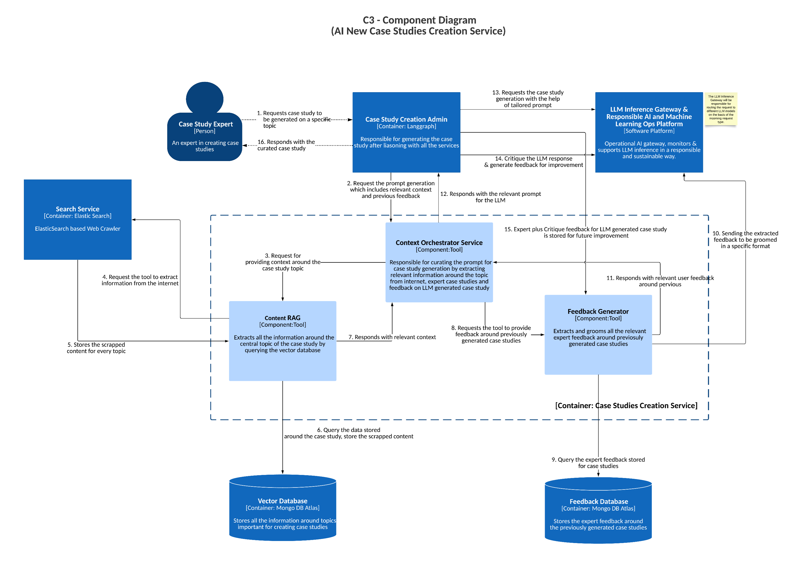

# **AI New Case Studies Creation Service (C3 - Component Diagram)**  

## **Description**  

The **AI New Case Studies Creation Service** is designed to **generate, critique, and validate case studies** using AI-assisted workflows. It operates across two primary workflows:  

1. **Case Study Creation Flow** – Focused on generating and refining case studies.  
2. **LLM Critique & Refinement Flow** – Ensures quality control, detects issues, and enhances case studies through AI-driven analysis.  

  

## **Core Functionality**  

- **Case Study Administration**: Provides an interface for experts to create, modify, and review case studies.  
- **Context-Orchestrated Case Study Generation**: Uses AI to generate case studies enriched with relevant contextual data.  
- **Retrieval-Augmented Generation (RAG)**: Retrieves and cross-references information to refine case studies.  
- **Search & Trend Analysis**: Updates case studies based on industry trends and external sources.  
- **Feedback-Driven Refinement**: Enhances case study quality through expert feedback and AI-driven critiques.  
- **LLM-Powered Case Study Processing**: Generates, critiques, and validates case studies while ensuring alignment with expert standards.  
- **Automated Quality Assurance**: Detects leaks, tracks performance, and flags outdated case studies for expert intervention.  

## **Key Components**  

### **1. Case Study Creation Admin**  
- Acts as the **primary interface** for **Case Study Experts**.  
- Manages **case study creation, modification, and review** workflows.  
- Coordinates with the **Context Orchestrator** and **LLM Inference Gateway** for AI-assisted generation.  
- Handles **final approval, storage, and feedback** of validated case studies.  

### **2. Context Orchestrator**  
- **Retrieves and structures contextual data** to enrich AI-generated case studies.  
- Extracts **relevant information** from past case studies, industry sources, and expert feedback.  
- Ensures generated case studies **align with predefined quality standards**.  
- Works with **Content RAG** and **Feedback Generator** to refine case study inputs.  

### **3. Content RAG (Retrieval-Augmented Generation)**  
- **Retrieves contextual data** from the **Vector Database**.  
- Queries the **Search Service** to extract additional relevant information.  
- Combines retrieved content to ensure **comprehensive and well-informed case studies**.  

### **4. Search Service**  
- Uses **ElasticSearch-based web crawlers** to gather **external data**.  
- Searches predefined websites for **industry trends** and related insights.  
- Provides **trend analysis** to inform case study updates.  

### **5. Feedback Generator**  
- Stores and retrieves **expert feedback** on generated case studies.  
- Uses **AI-driven critique** to refine case study quality.  
- Captures **new expert feedback** to enhance AI-generated case studies.  
- Maintains **historical feedback records** to improve future case study creation.  

### **6. LLM Inference Gateway**  
- Processes **context-enriched case study requests** from the **Context Orchestrator**.  
- Generates **AI-driven case study drafts**.  
- **Analyzes and critiques** generated case studies for quality and relevance.  
- Ensures case studies **adhere to expert-defined standards**.  

---

## **Data Stores**  

### **1. Vector Database**  
- Stores **case study trends, domain knowledge, and reference materials**.  
- Maintains **rules, context, and relationships** for case study structuring.  

### **2. Feedback Database**  
- Archives **expert feedback** on generated case studies.  
- Stores **historical improvement data** for iterative refinement.  

---

## **Automated Analysis Workflow**  

The **Automated Analysis Flow** ensures continuous quality control by:  

1. **Monitoring case study performance** and relevance.  
2. **Detecting leaks** to prevent exposure of proprietary content.  
3. **Identifying case studies with high failure rates (90-95%)** for expert review.  
4. **Automatically flagging outdated or weak case studies** for intervention.  
5. **Updating case study status** across all relevant databases.  

---

## **Security and Quality Controls**  

### **1. Case Study Validation**  
- **Multi-stage AI + expert review** for all AI-generated case studies.  
- **Leak detection** to prevent unauthorized distribution.  
- **Performance monitoring** to ensure **accuracy and relevance**.  
- **Expert approval required** for final publication.  

### **2. Quality Assurance**  
- **Failure rate tracking** to detect problematic case studies.  
- **Context relevance checks** to ensure factual accuracy.  
- **LLM-driven critique** for refining AI-generated content.  

### **3. Feedback Loop**  
- **Continuous improvement** via **expert feedback** and **AI-driven critique**.  
- **Historical performance tracking** to measure **case study effectiveness**.  
- **Industry trend analysis** to **align content with real-world needs**.  
- **Automated quality metrics** to maintain **long-term validity**.  

---

## **Integration Points**  

### **1. External Systems**  
- **Web crawlers** for **industry trend analysis and validation**.  
- **Industry monitoring** to detect **emerging topics**.  
- **LLM integration** for **AI-driven case study generation and refinement**.  
- **Expert-facing interfaces** for **manual intervention and feedback**.  

### **2. Internal Systems**  
- **Database synchronization** for real-time updates.  
- **AI-driven grading and review services**.  
- **Automated feedback processing** for refining AI-generated content.  
- **Case study tracking** for version control and quality monitoring.  

---

## **System Boundaries**  

The system maintains **strict modular separation** between:  
- **User interaction layers** (experts creating and modifying case studies).  
- **Processing services** (LLM-driven generation, critique, and review).  
- **Storage systems** (Vector DB, Feedback DB).  
- **Automated analysis components** (Content RAG, Context Orchestrator).  
- **Feedback mechanisms** (expert input and AI-driven iterative refinement).  

This architecture ensures **scalability, maintainability, and high-quality AI-assisted case study management**, while enabling **continuous improvement through expert oversight and automated analytics**.  

## **Tech Stack**

- **Messaging Topic (GCP Pub/Sub or Kafka)**
- **PostgreSQL DB**
- **Mongo DB**
- **ElasticSearch**
- **Python**