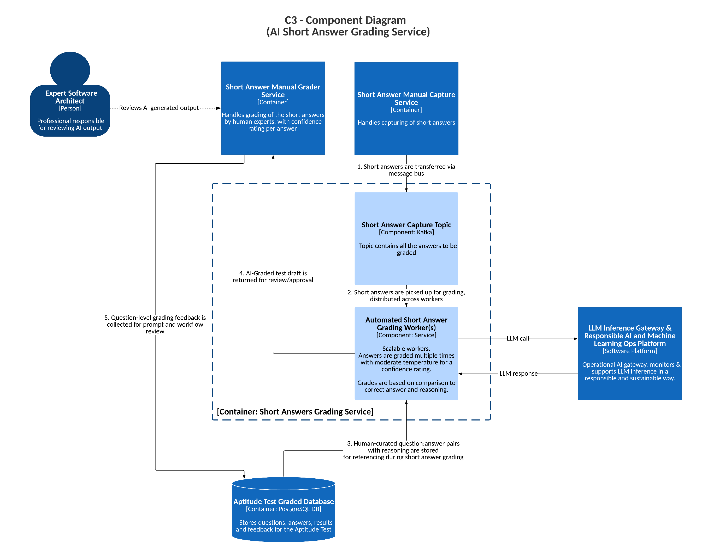

# **Short Answer Grading Service Component (C3 - Component Diagram)**

## **Description**

The **Short Answer Grading Service** assists in grading short answers from aptitude tests. It leverages AI to automate the evaluation of short-answer responses, ensuring consistency and fairness. This service reduces grading time, allowing experts to focus on ambiguous cases, and quickly review answers the AI is confident are either poor or good.

The short answer grading service utilizes AI to score solutions against a curated grading framework while allowing for expert review and feedback. This grading framework will be curated by human experts as part of the AI transformation process and take the form of a question with short answer pairs along with reasoning to assist the grading process.

## **Core Functionality**

- **Automated Short Answer Grading**: Uses AI with natural language processing (NLP) to evaluate short-answer responses.
- **Consistency and Accuracy Checker**: Aligns AI-generated evaluations with grading rubrics to ensure evaluations are consistent and unbiased.
- **Confidence Metrics**: Generates a grade confidence metric for each question using multiple grading passes with moderate temperature sampling.
- **Expert Review**: Allows experts to review, adjust, and finalize AI-graded responses via the **Short Answer Manual Grader Service**.
- **Explainable AI Feedback**: Provides students with feedback detailing why a specific score was assigned.
- **Short Answer Capture and Workflow Management**: Manages the collection and distribution of short answers for both automated and manual grading.

## **Key Components**

- **Short Answer Manual Capture Service**: Captures short answers submitted by candidates and transfers them to the grading pipeline via a message bus.
- **Short Answer Capture Topic**: A Kafka topic that contains all answers to be graded, distributed across workers for processing.
- **Automated Short Answer Grading Worker(s)**: Scalable workers that grade answers multiple times using moderate temperature to generate confidence ratings. Grades are based on comparison to correct answers and reasoning.
- **Short Answer Manual Grader Service**: Provides an interface for human experts to validate AI-graded responses, ensuring quality and confidence ratings for ambiguous cases.
- **LLM Inference Gateway**: Routes LLM calls to different service providers via configuration, validates and filters the LLM calls, and dispatches responses to downstream monitoring components.
- **Responsible AI Platform**: Ensures LLM responses are safe, reliable, and aligned with Responsible AI policies.
- **Aptitude Test Graded Database**: Stores questions, answers, results, and feedback, along with human-curated question/answer pairs for reasoning-based referencing during grading.

## **Data Flow**

1. Short answers are captured by the **Short Answer Manual Capture Service** and transferred via a message bus to the **Short Answer Capture Topic**.
2. The **Automated Short Answer Grading Worker(s)** pick up the short answers for grading. Grading occurs multiple times to calculate confidence metrics.
3. Human-curated question/answer pairs with reasoning are stored in the **Aptitude Test Graded Database** for referencing during automated grading.
4. AI-graded test drafts are returned to the **Short Answer Manual Grader Service** for manual review and approval.
5. Question-level grading feedback is collected for future prompt improvement and reinforcement learning of in-house LLM models.

## **Benefits**

- Reduces grading time per candidate from 3 hours to 1 hour (estimated).
- Improves consistency and reduces bias in grading.
- Enables the use of reinforcement learning to improve in-house LLM models.

## **Tech Stack**

- **Messaging Topic (GCP Pub/Sub or Kafka)**
- **PostgreSQL DB**
- **Python**
