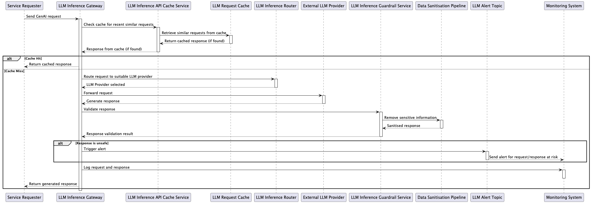

# LLM Inference Gateway Sequence Diagram

## Description
This sequence diagram outlines the flow of a GenAI request through the LLM Inference Gateway, from the service requester to response generation, caching, validation, and alerting.

## Steps
1. **Send GenAI Request:** The service requester sends a request to the LLM Inference Gateway.
2. **Cache Check:** Gateway checks the cache for similar recent requests.
   - If found, returns cached response.
   - If not found, routes request to an appropriate LLM provider.
3. **LLM Provider Selection:** The inference router selects the external LLM provider and forwards the request.
4. **Generate Response:** External LLM provider generates the response.
5. **Validate Response:** The response is validated by the Guardrail Service for safety and sensitive information.
   - If unsafe, triggers an alert and sends it to the monitoring system.
6. **Sanitise Response:** Data sanitisation pipeline removes sensitive information if needed.
7. **Log Request and Response:** Logs are maintained for monitoring purposes.
8. **Return Response:** The final response is returned to the service requester.
