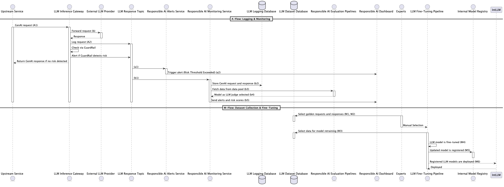

# Responsible AI Sequence Diagram

## Description
This sequence diagram illustrates the logging, monitoring, and dataset collection for responsible AI processes during LLM operations.

## Steps
1. **GenAI Request:** Upstream service sends a GenAI request to the LLM Inference Gateway.
2. **Request Forwarding:** Gateway forwards the request to an external LLM provider.
3. **Response Handling:** The response is logged, and Guardrail checks for risks.
   - If risk is detected, an alert is triggered.
4. **Logging and Monitoring Flow:** Logs are stored, and data is fetched for analysis.
5. **Dataset Collection and Fine-Tuning:** Golden requests and responses are selected manually for retraining.
6. **Model Fine-Tuning:** The selected data is used for fine-tuning LLM models.
7. **Model Deployment:** Updated models are registered and deployed through the internal registry.
