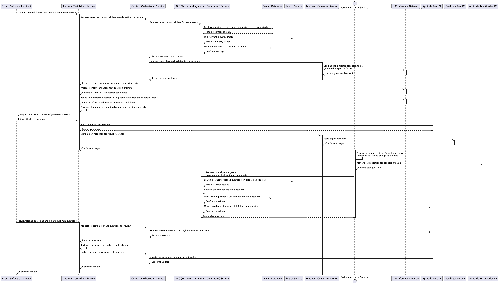

# Test Creation and Modification Sequence Diagram

## Description
This sequence diagram showcases the process of modifying and refining AI-generated test questions using contextual data and expert feedback.

## Steps
1. **Context Retrieval:** Test Admin Service retrieves contextual data from various services.
2. **Data Retrieval:** Context Orchestrator and RAG services pull industry trends and reference materials.
3. **Processing:** Context-enhanced prompts are processed to generate AI-driven test candidates.
4. **Refinement:** Generated questions are refined using contextual data and expert feedback.
5. **Manual Review:** Expert architects review and provide feedback.
6. **Validation:** Adherence to rubrics is ensured, and validated questions are stored in the database.
