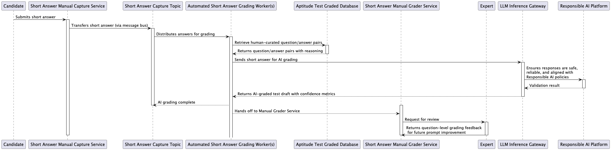

# Short Answer Grading Sequence Diagram

## Description
This sequence diagram displays the process of grading short answers using AI and incorporating expert review workflows.

## Steps
1. **Submission:** Candidate submits a short answer to the Manual Capture Service.
2. **Transfer:** The short answer is transferred via message bus to the Capture Topic.
3. **Distribution:** Answers are distributed to Automated Grading Workers.
4. **AI Grading:** Workers retrieve curated Q&A pairs, grade the answer, and return a draft with confidence metrics.
5. **Manual Review:** Draft is sent to the Manual Grader Service for review.
6. **Validation:** LLM Inference Gateway validates responses against Responsible AI policies.
7. **Feedback:** Manual graders provide feedback for prompt improvements.
