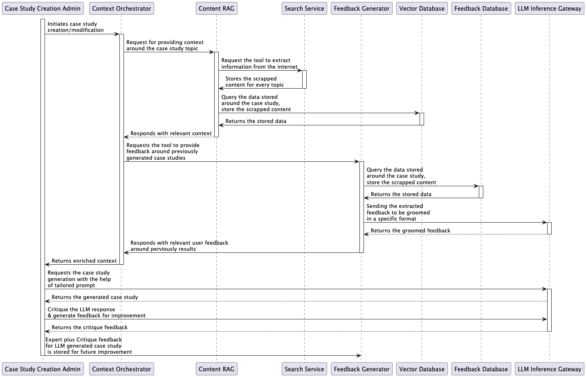

# Architecture Solution Sequence Diagram

## Description
This sequence diagram details the grading and review process for architecture solution case studies, incorporating AI-based assessment and expert review workflows.

## Steps
1. **Receive Submission:** The Architecture Solution Capture Service receives a case study submission and sends it via a message bus.
2. **Distribute Submissions:** The Architecture Solution Capture Topic distributes submissions to grading workers.
3. **Fetch Marking Rubric:** The Automated Grading Worker retrieves the associated marking rubric and model answers.
4. **Grade Solution:** AI grades solutions against predefined rubrics using multiple passes for confidence estimation.
5. **Send to Review Worker:** Grading results are forwarded to the Automated Review Worker.
6. **Generate Feedback:** The review worker fetches the rubric again and generates detailed feedback reports based on grading results.
7. **Manual Expert Review:** The Architecture Solution Manual Grader Service allows experts to review and refine AI-generated grades.
8. **Store Results:** The final grading, feedback, and refined results are stored in the graded database for future reference.
9. **Notify Adjustments:** The system notifies stakeholders about expert adjustments to AI-generated grades.
