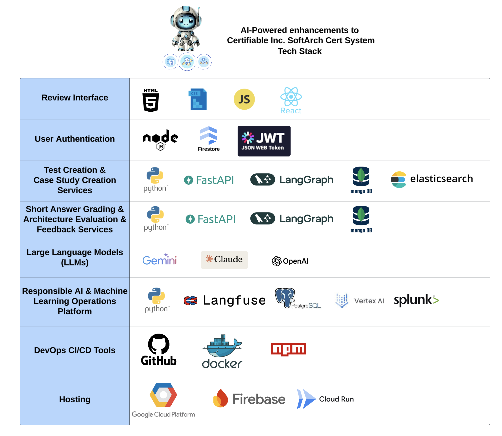

# Certifiable, Inc. SoftArch Cert System’s AI-powered Services - Tech Stack

## **Review Interface**

- **Technologies**: HTML5, CSS3, JavaScript, React.js
- **Purpose**:
  - Build the user interface for the AI assistant.
  - Ensure a responsive and interactive design for customer interactions.

## **User Authentication**

- **Technologies**: Node.js, Firestore, JSON Web Tokens (JWT)
- **Purpose**:
  - Authenticate registered users.
  - Support secure guest logins.

## **Test Creation & Case Study Services**

- **Technologies**: Python, FastAPI, LangGraph, Mongo DB, elasticsearch
- **Purpose**:
  - Handle all backend processes, routing, and API calls for data retrieval.
  - Support fast and scalable API development.
  - Store and manage structured data with MongoDB.
  - Implemented Search Crawler, ranking
  
## **Short Answer Grading & Architecture Evaluation & Feedback Services**

- **Technologies**: Python, FastAPI, LangGraph, Mongo DB, elasticsearch
- **Purpose**:
  - Handle all backend processes, routing, and API calls for data retrieval.
  - Store and manage structured data with MongoDB.
  - Support fast and scalable API development.

## **Large Language Models (LLMs)**

- **Technologies**: Gemini 1.5 Flash, Claude 3.5 Sonnet, Open AI
- **Purpose**:
  - Provide advanced natural language understanding and generation capabilities.
  - Ensure high-quality, context-aware responses.

## **Responsible AI & Machine Learning Operations Platform**

- **Technologies**: Python, LangFuse, PostgreSQL, Vertex AI, Splunk
- **Purpose**:
  - Monitor AI performance, track bias, and ensure compliance with Responsible AI practices.
  - Support logging and reporting for operational metrics.

## **DevOps CI/CD Tools**

- **Technologies**: GitHub, Docker, npm
- **Purpose**:
  - Manage version control, containerization, and automated deployment pipelines.

## **Hosting**

- **Technologies**: Google Cloud Platform, Firebase, Cloud Run
- **Purpose**:
  - Provide cloud hosting for scalable and reliable deployment of the AI assistant.
