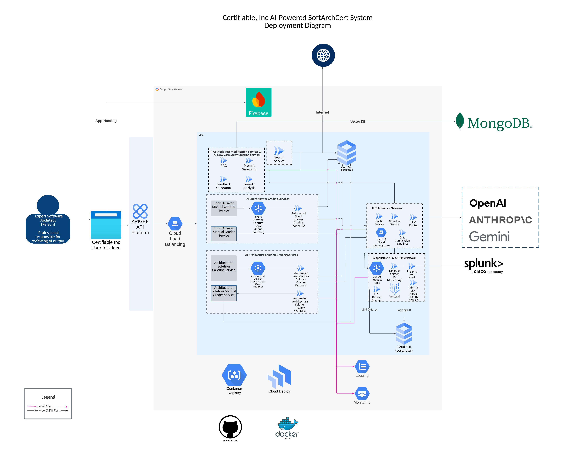

# Certifiable AI Deployment Infrastructure Diagram

## Overview
This infrastructure diagram outlines the deployment architecture for AI services in Google Cloud Platform (GCP), featuring integration with multiple AI providers (OpenAI, Anthropic, Splunk) and various service components for AI model management and inference.

  

## Architecture Components

### Network Infrastructure
- **Apigee API Gateway**:
  - API management and proxy layer
  - Security and authentication
  - Rate limiting and quota management
  - API versioning and documentation
- **Cloud Load Balancer**:
  - Distributes traffic between backend services
  - Ensures high availability
  - Handles SSL termination
  - Provides health checking

### Core Infrastructure
- **Expert Software Architect Interface**: Entry point for professional AI output management
- **Firebase**: Used for application hosting and management
- **Google Cloud Platform**: Primary cloud infrastructure provider

### Cloud Services

#### Compute Services
- **Cloud Run**:
  - Hosts all API services
  - Manages background jobs
  - Provides serverless execution environment

#### Database Services
- **Cloud SQL**:
  - Primary PostgreSQL instance for test and graded databases
  - Secondary PostgreSQL instance for:
    - Mini model training data
    - System logging
- **MongoDB**: Serves as the vector database
- **Cloud Memorystore**: Redis implementation for caching

#### Messaging and Event Management
- **Cloud Pub/Sub**: Handles asynchronous messaging and event-driven architectures

#### AI/ML Infrastructure
- **Vertex AI**: 
  - Evaluates AI-generated output
  - Manages model training and deployment
  - Provides ML operations platform

### Integration Components
- **LLM Inference Gateway**: Manages communication with AI providers
- **ML Ops Platform**: Handles model operations and monitoring
- **Cloud Deployment**: Manages service deployment and scaling

### Request Flow
1. Client requests are received by Apigee API Gateway
2. Requests are routed through Cloud Load Balancer
3. Load Balancer distributes traffic to appropriate Cloud Run services
4. Backend services process requests and interact with necessary resources

### Monitoring and Analytics
- **Splunk Integration**:
  - Custom dashboards for system monitoring
  - Alerting system for infrastructure and application metrics
  - Log aggregation and analysis
  - Performance monitoring

### CI/CD Pipeline
- **GitHub Actions**: 
  - Automated build and deployment workflows
  - Integration testing
  - Continuous deployment to Cloud Run

- **Container Management**:
  - **Cloud Registry**: Storage for Docker images
  - **Cloud Deploy**: Manages deployment orchestration
  - **Docker**: Container creation and management

### External AI Provider Integration
- OpenAI services integration
- Anthropic AI capabilities
- Splunk analytics integration

## Technical Stack
- **Version Control**: GitHub
- **Containerization**: Docker
- **Cloud Services**: Google Cloud Platform
- **API Gateway**: Apigee
- **Load Balancing**: Cloud Load Balancer
- **Databases**: 
  - PostgreSQL (Cloud SQL)
  - MongoDB (Vector Database)
  - Redis (Cloud Memorystore)
- **Deployment**: Cloud Deploy
- **Message Queue**: Cloud Pub/Sub
- **ML Platform**: Vertex AI

## Security and Access
- Secured API endpoints through Apigee
- Professional access control
- Multiple verification layers
- Feature gating and access analysis
- SSL/TLS encryption at load balancer level

## Monitoring and Logging
- Splunk-based monitoring and alerting
- ML Ops monitoring
- Performance metrics tracking
- Request tracing capabilities
- Dedicated logging database in Cloud SQL
- API Gateway metrics and analytics
