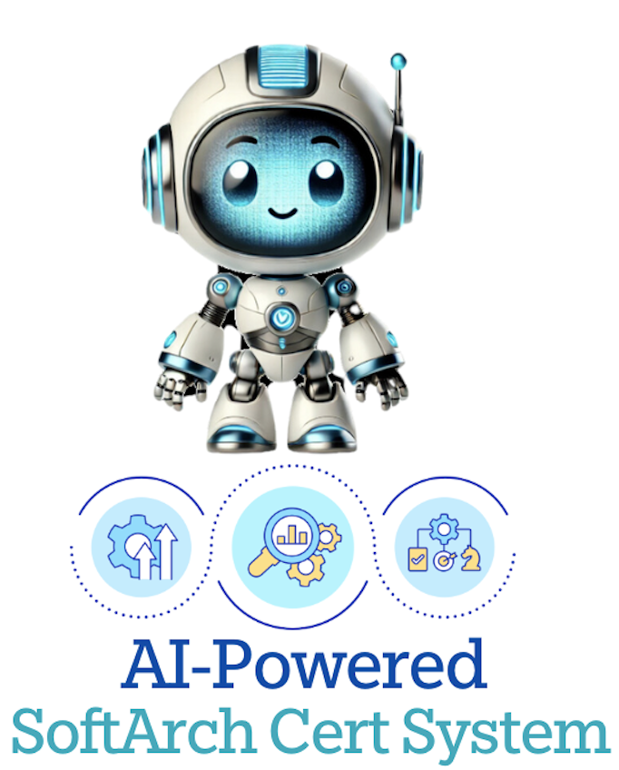
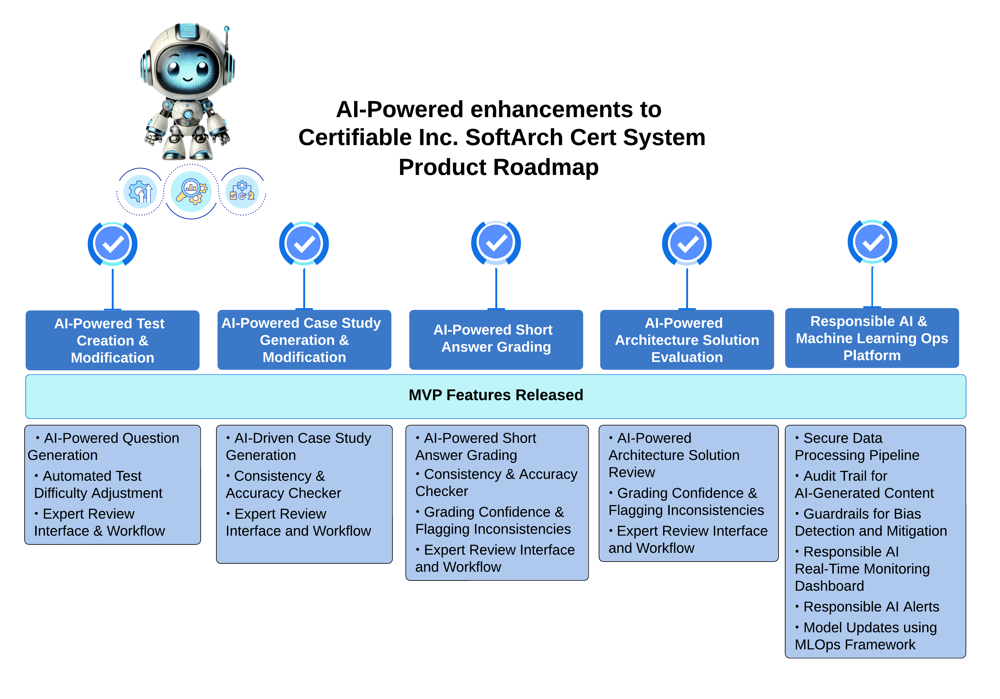
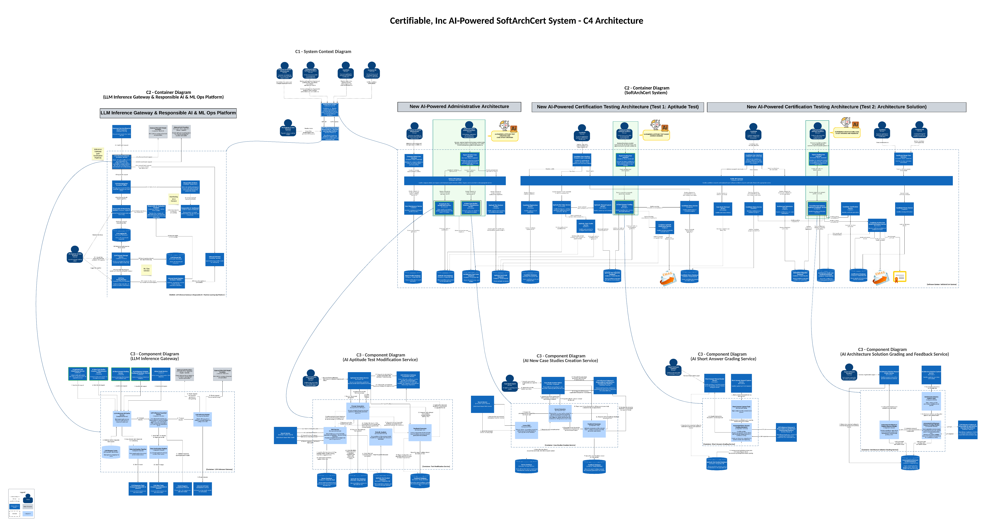
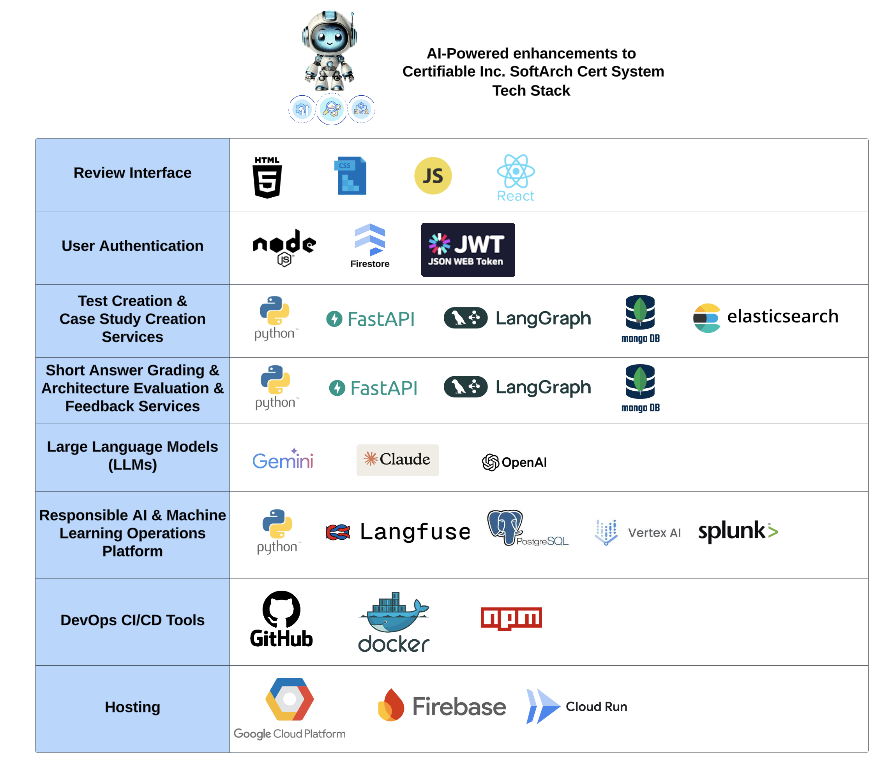
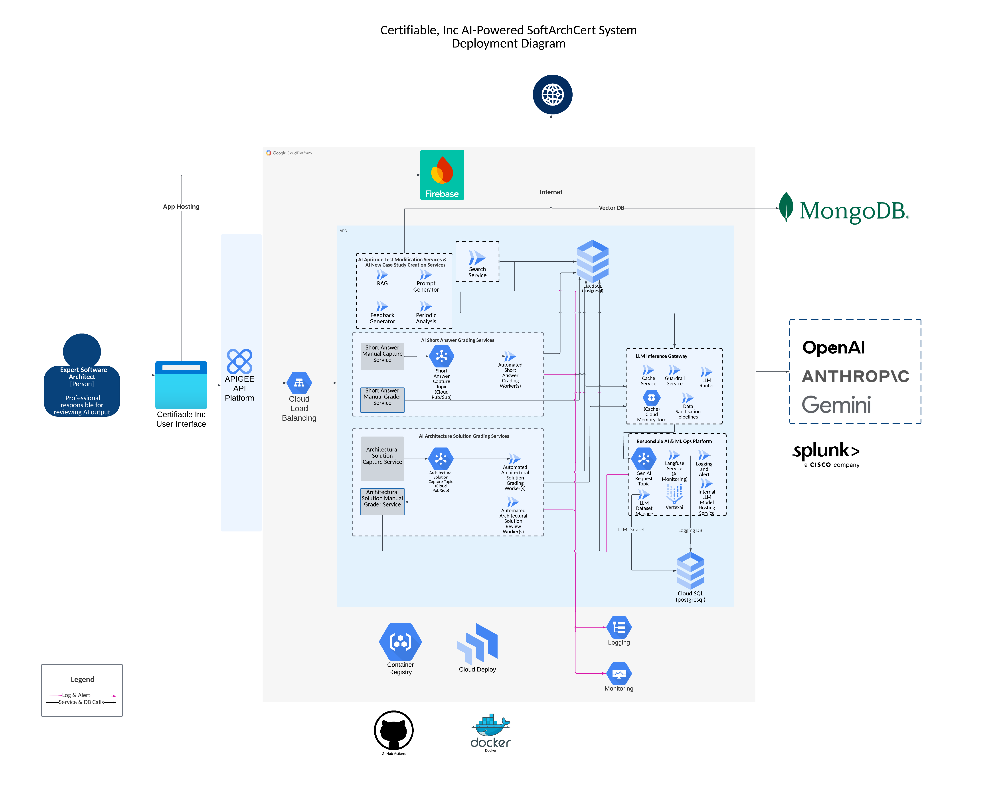

# Connected AI Team's - AI-Powered SoftArchCert System

  
    
  
 

## 📑 Table of Contents

- [🛠️ Overview](#%EF%B8%8F-overview)
  - [ℹ️ About the Project](#ℹ%EF%B8%8F-about-the-project)
- [🌟 Team Members](#-team-members)
- [📝 Requirements](#-requirements)
  - [🔧 Functional Requirements](#-requirements)
  - [📐 Non-Functional Requirements](#-requirements)
  - [⚖️ Assumptions and Constraints](#-requirements)
- [🚀 Features and Roadmap](#-features-and-roadmap)
- [🏛️ Architecture and Design](#%EF%B8%8F-architecture-and-design)
  - [🔍 Design Highlights](#-design-highlights)
  - [📂 Current State](#-current-state)
  - [📊 Target State - C4 Architecture](#-target-state---c4-architecture)
  - [🏗️ Target State - Architecture Design Documents](#%EF%B8%8F-target-state---architecture-design-documents)
- [📚 Architecture Decision Records (ADRs)](#-architecture-decision-records-adrs)
- [🛡️ Tech Stack](#%EF%B8%8F-tech-stack)
- [📈 Sequence Diagrams](#-sequence-diagrams)
- [🌐 Platform Diagram](#-platform-diagram)

---

## 🛠️ Overview

### ℹ️ About the Project

Certifiable, Inc. is facing a major scalability challenge due to a projected 5-10X increase in certification requests, driven by global expansion into Europe, the U.K., and Asia. The current system, **SoftArchCert**, relies heavily on manual processes—expert software architects create and maintain certification tests, review submissions, and grade results. Given the expected surge in demand, these manual workflows are unsustainable and risk becoming a bottleneck.

To address this, our architecture team must **assess and design AI-driven enhancements** to SoftArchCert that:

1. **Streamline certification workflows** by automating aspects of test generation, submission evaluation, and grading.
2. **Ensure scalability** without compromising certification quality or accreditation standards.
3. **Integrate Generative AI** where it can provide efficiency gains while maintaining human oversight where necessary.

Our goal is to **identify AI opportunities, propose architectural changes, and develop a roadmap** for implementing AI-driven enhancements that allow Certifiable, Inc. to meet growing demand while maintaining its leadership in software architecture certification.

- 📜 [Overview](1_overview/01-overview.md)
  - Provides a **high-level summary** of the SoftArchCert System, outlining its purpose, scope, and key objectives.
- 📌 [Current State](1_overview/02-current-state.md)
  - Describes the **existing system**, highlighting challenges, inefficiencies, and areas for improvement.
- 🎯 [Target State](1_overview/03-target-state.md)
  - Defines the **future vision** for the SoftArchCert System, detailing AI-driven enhancements and improvements.
- ⚙️ [Benefits of Automation](1_overview/04-benefits-of-automation.md)
  - Explores how **automation and AI** will enhance efficiency, scalability, and reliability in certification processes.

---

### 🌟 **Team Members**

Hi! We are the **"ConnectedAI Team"** – a group of innovative minds from **Woolworths Group, Australia**.

- **[Abhinav Singh](https://www.linkedin.com/in/init-abs)** - Senior ML Engineer
- **[Kenichi Nakanishi](https://www.linkedin.com/in/kenichinakanishi)** - Lead Data Scientist
- **[Meena Kasi](https://www.linkedin.com/in/meenakasi/)** - Solutions Architect
- **Xun Zhou** - ML Engineer Manager
- **[Yogesh Pathade](https://www.linkedin.com/in/yogeshpathade/)** - Tech Lead

---

## 📝 Requirements

Refer to the detailed requirements:

- [🔧 Functional Requirements](2_requirements/01-functional-requirements.md)
  - The functional requirements of the AI-powered SoftArch Cert System ensure seamless integration, automating test creation, grading, and evaluation while maintaining expert oversight and industry compliance.
- [📐 Non-Functional Requirements](2_requirements/02-non-functional-requirements.md)
  - The non-functional requirements of the AI-powered SoftArch Cert System ensure usability, scalability, reliability, and security while maintaining ethical AI practices, seamless integration, auditability, and adaptability to evolving certification needs.
- [⚖️ Assumptions and Constraints](2_requirements/03-assumptions-and-constraints.md)
  - The assumptions and constraints of the AI-powered SoftArch Cert System outline expected expert involvement, system compatibility, regulatory stability, and AI interpretability while defining boundaries around evaluation standards, security compliance, performance limitations, and version control.

---

## 🚀 Features and Roadmap

For more details, please see [⭐ Features and Roadmap](3_features_and_roadmap/features.md)

---

## 🏛️ Architecture and Design

### 🔍 Design Highlights

- **In-Context Learning**: Utilises commercial LLMs for high flexibility, performance, and reduced development time.
- **Responsible AI Inference Platform**: Ensures AI model performance monitoring, cost evaluation, Responsible AI risk assessment, and security/ethical alerting. Supports logging, tracking, dataset collection, and fine-tuning for transparency and continuous improvement. The LLM Inference Gateway validates responses against safety and ethical guidelines. It also enabled reinforcement learning to improve the AI-as-a-judge in a sustainable way.
- **Cost-Effectiveness**:
  - In-context learning minimises training costs.
  - Shared RAG service reduces redundancy and infrastructure expenses.
  - Open-source components like LangFuse enhance cost efficiency in tracking, evaluation, and MLOps.
  - The LLM Inference Gateway optimises costs via caching and intelligent provider selection.
- **Model Lifecycle Management & MLOps**:
  - Incorporates best practices for model lifecycle management.
  - The LLM Dataset Management Service curates datasets for fine-tuning and selects golden data.
  - The LLM Fine-Tuning Pipeline ensures continuous learning and accuracy improvements.
  - An Internal Model Registry ensures reproducibility and controlled deployment of updated LLM models.
- **Data Governance**: Implements policies ensuring data privacy and compliance.

### 📂 Current State

- 🗺️ [Current System Context](4_architecture_and_design/current/current-c1-system-context.md)
  - Describes the **existing system context**, including key stakeholders, interactions, and high-level architecture.
- 🏗️ [Current SoftArchCert System - Container Diagram](4_architecture_and_design/current/current-c2-container-current-softarch-cert-system.md)
  - Outlines the **current container-level architecture**, detailing existing services, components, and dependencies.

### 📊 Target State - C4 Architecture

### 🏗️ Target State - Architecture Design Documents

- 🏛️ [Architecture Overview](4_architecture_and_design/target/architecture.md)
  - Details the AI-powered SoftArchCert System's target state architecture using the C4 model, detailing its scalable AI-driven certification process, automated grading, test creation, and expert validation, while ensuring responsible AI operations.
- 🗺️ [C1 - System Context](4_architecture_and_design/target/c1-system-context.md)
  - Summarises the target state of the C1 system context level for the SoftArchCert System.
- 📦 [C2 - SoftArch Cert System Container](4_architecture_and_design/target/c2-container-1-target-softarch-cert-system.md)
  - Summarises the target state of the SoftArchCert System, integrating AI-powered automation for test creation, grading, and certification while ensuring expert oversight through validation interfaces, enhancing scalability, accuracy, and responsible AI-driven certification management.
- 🔒 [C2 - Gateway for Responsible AI &amp; ML Ops](4_architecture_and_design/target/c2-container-2-gateway-responsible-ai-ml-ops-platform.md)
  - Details the **LLM Gateway and Observability & Monitoring Component**, which ensures responsible AI operations by tracking model performance, monitoring costs, evaluating ethical risks, and enabling continuous fine-tuning through structured logging, alerting, and dataset management.
- ⚡ [C3 - LLM Inference Gateway](4_architecture_and_design/target/c3-component-ai-1-llm-inference-gateway.md)
  - Details the **LLM Inference Gateway**, which routes, validates, filters, and caches LLM calls to ensure safe, reliable, and cost-effective AI interactions while enforcing Responsible AI principles through data sanitization and guardrails.
- 📝 [C3 - Aptitude Test Modification Service](4_architecture_and_design/target/c3-component-ai-aptitude-test-modification-service.md)
  - Details the **Aptitude Test Modification Service**, which automates the generation, refinement, and validation of test questions using AI-powered workflows, expert oversight, retrieval-augmented generation, and continuous feedback to ensure accuracy, relevance, and test integrity.
- 📖 [C3 - New Case Studies Creation Service](4_architecture_and_design/target/c3-component-ai-new-case-studies-creation-service.md)
  - Details the **New Case Studies Creation Service**, which automates the generation, critique, and validation of case studies using AI-driven workflows, retrieval-augmented generation, and expert oversight to ensure high-quality, relevant, and continuously improving educational content.
- ✍️ [C3 - Short Answer Grading Service](4_architecture_and_design/target/c3-component-ai-short-answer-grading-service.md)
  - Summarises the **Short Answer Grading Service**, which automates the evaluation of short-answer responses using AI-driven grading, confidence metrics, and expert oversight to ensure fairness, consistency, and explainable feedback while aligning with Responsible AI principles.
- 🏗️ [C3 - Architecture Solution Grading &amp; Feedback Service](4_architecture_and_design/target/c3-component-ai-architecture-solution-grading-and-feedback-service.md)
  - Details the **Architecture Solution Grading and Feedback Service**, which automates the grading of case study submissions using AI-driven rubrics, confidence metrics, and expert review to ensure consistent, fair, and explainable evaluations while enabling Responsible AI oversight.

---

## 📚 Architecture Decision Records (ADRs)

Find the architecture decision records in the [📄 ADRs folder](5_adrs/).

- 📚 [ADR: In-Context Learning](5_adrs/001_adr_in_context_learning.md)
  - Discusses the decision to use **in-context learning** with commercial LLMs for AI-powered capabilities, prioritizing **flexibility**, performance, and reduced development time over fine-tuning approaches.
- 🔍 [ADR: Own Web Scraper](5_adrs/002_adr_own_web_scraper.md)
  - Discusses the decision to develop an **in-house** web scraping service for detecting AI test question leakage, prioritizing **control**, customization, and cost-efficiency over enterprise or hybrid solutions while addressing legal, security, and scalability concerns.
- ✂️ [ADR: LLM Prompt Trimming](5_adrs/003_adr_llm_prompt_trimming.md)
  - Discusses the decision to use LLM-based **prompt trimming** to optimize **costs** and improve performance while addressing potential latency, dependency, and explainability concerns.
- 🔗 [ADR: Shared RAG Service](5_adrs/004_adr_shared_rag_service.md)
  - Discusses the decision to implement a **shared RAG service** for AI-powered enhancements, prioritizing **efficiency**, cost optimization, and consistency while planning for future scalability and performance considerations.
- 🗄️ [ADR: MongoDB Vector DB](5_adrs/005_adr_mongodb_vector_db.md)
  - Discusses the decision to use **MongoDB Atlas** as the vector database, prioritizing **integration**, reliability, and scalability while considering trade-offs in performance, feature set, and operational overhead.
- 🏗️ [ADR: Human-in-the-Loop](5_adrs/006_adr_human_in_loop.md)
  - Discusses the decision to implement a **Human-in-the-Loop** approach for AI-powered enhancements, ensuring quality, **fairness**, and compliance while balancing scalability, cost, and expert workload.
- 🚪 [ADR: Custom API Gateway](5_adrs/007_adr_custom_api_gateway.md)
  - Discusses the decision to implement a **custom API gateway**, prioritizing **security**, performance, and flexibility over off-the-shelf solutions while considering trade-offs in development effort and maintenance complexity.
- 🧩 [ADR: LangGraph Framework](5_adrs/008_adr_langgraph_framework.md)
  - Discusses the decision to use **LangGraph** as the language model orchestration framework, prioritizing **structured workflows**, scalability, and team familiarity while considering the trade-offs of complexity and development effort.
- 📊 [ADR: LangFuse MLOps](5_adrs/009_adr_langfuse_mlops.md)
  - Discusses the decision to use **LangFuse** as the evaluation and MLOps platform, prioritizing **offline model evaluation**, tracing, and cost-effectiveness while considering the trade-offs of deployment and maintenance effort.
- ⚡ [ADR: Caching Mechanisms](5_adrs/010_adr_caching_mechanisms.md)
  - Discusses the decision to implement **server-side caching** with Redis or Memcached, prioritizing **performance**, scalability, and reduced service load while considering the trade-offs of infrastructure complexity and cache management.
- ☁️ [ADR: Hosting on GCP and Firebase](5_adrs/011_adr_hosting_gcp_firebase.md)
  - Discusses the decision to host **backend services** on GCP and the frontend on Firebase Deploy with Cloud Run, prioritizing **scalability**, integration, and ease of maintenance while considering trade-offs in platform management and cost optimization.
- 🔄 [ADR: CI/CD Pipeline](5_adrs/012_adr_ci_cd_pipeline.md)
  - Discusses the decision to implement **GitHub Actions** for the CI/CD pipeline, prioritizing **automation**, integration, and rapid deployment while considering trade-offs in platform dependency and flexibility.
- 📦 [ADR: Docker Cloud Run](5_adrs/013_adr_docker_cloud_run.md)
  - Discusses the decision to use **Docker** for containerization and deploy on Google Cloud Run, prioritizing **deployment consistency**, scalability, and operational simplicity while considering trade-offs in infrastructure control and potential vendor lock-in.
- 🔐 [ADR: Authentication &amp; Authorisation](5_adrs/014_adr_authentication_authorisation.md)
  - Discusses the decision to implement **authentication** using username/password with JWT, prioritizing **security**, scalability, and future-proofing while considering trade-offs in key management and potential future integration with OAuth2 and SSO.

---

## 🛡️ Tech Stack

For details, please see [🛠️ Detailed Tech Stack](7_tech_stack/tech-stack.md)

---

## 📈 Sequence Diagrams

Find the sequence diagrams in the [📉 Sequence Diagrams folder](6_sequence_diagrams/)

---

## 🌐 Platform Diagram

For details, please see [🌐 Detailed Platform Diagram](8_platform_diagram/platform_diagram.md)

---
